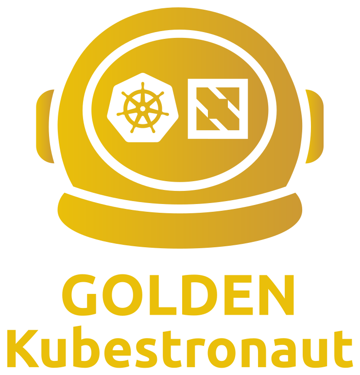

# Golden Kubestronaut

<p align="center">
  
</p>

Welcome to my personal journey toward becoming a **Golden Kubestronaut** —  a lifetime Kubernetes expert title awarded by the Linux Foundation.

This repository documents everything I learn and create along the way, including study notes, code samples, tips, cheatsheets, and helpful resources.

**Let’s get certified — one pod at a time!**

* [](./certifications/cgoa/cgoa-study-guide.md)
* [](./certifications/capa/capa-study-guide.md)


## 🌟 Exams to Pass

| #  | Certification Name                                                                                      | Status                                                                                   | Planned Study Duration | Recommended Study Duration |
|----|----------------------------------------------------------------------------------------------------------|------------------------------------------------------------------------------------------|------------------------|------------------------|
| 1  | [KCNA – Kubernetes and Cloud Native Associate Exam](./certifications/kcna/)                                  |    | TBD                    | TBD                    |
| 2  | [KCSA – Kubernetes and Cloud Security Associate](./certifications/kcsa/)                                |    | TBD                    | TBD                    |
| 3  | [CKA – Certified Kubernetes Administrator](./certifications/cka/)                                       |    | TBD                    | TBD                    |
| 4  | [CKAD – Certified Kubernetes Application Developer](./certifications/ckad/)                             |    | TBD                    | TBD                    |
| 5  | [CKS – Certified Kubernetes Security Specialist](./certifications/cks/)                                 |    | TBD                    | TBD                    |
| 6  | [PCA – Prometheus Certified Associate](./certifications/pca/)                                           |    | TBD                    | TBD                    |
| 7  | [ICA – Istio Certified Associate](./certifications/ica/)                                                |    | TBD                    | TBD                    |
| 8  | [CCA – Cilium Certified Associate](./certifications/cca/)                                                   |    | TBD                   | TBD                    |
| 9  | [CAPA – Certified Argo Project Associate](./certifications/capa/)                           |     | 1 week                    | TBD                    |
| 10 | [CGOA – Certified GitOps Associate](./certifications/cgoa/cgoa-study-guide.md)                       |        | 1 week                | TBD                     |
| 11 | [CBA – Certified Backstage Associate](./certifications/cba/)                                          |    | TBD                    | TBD                    |
| 12 | [OTCA – OpenTelemetry Certified Associate](./certifications/otca/)                                      |    | TBD                    | TBD                    |
| 13 | [KCA – Kyverno Certified Associate](./certifications/kca/)                                              |    | TBD                    | TBD                    |
| 14 | [LFCS – Linux Foundation Certified System Administrator](./certifications/lfcs/)                        |    | TBD                    | TBD                    |

## 🗂️ Repository Structure

``` bash
├── docs/           # General tips and shared resources
├── shared/         # Reusable code, tools, aliases
├── certifications/ # Notes, code, and media for each certification
│ ├── cka/
│ ├── ckad/
│ ├── cks/
│ └── ...
├── changelog.md    # Changelog of progress
├── README.md       # You're here!

```

## 📚 How to Use This Repo

- Navigate to `certifications/<exam>/` for each certification's study materials
- Use `shared/` for reusable tools and snippets
- See `docs/` for general tips, resources, and references
- Follow my progress in `changelog.md`

### 🔄 Progress Log

To follow my progress in detail — including exam scheduling, study guide updates, and what's next — see the [CHANGELOG.md](./CHANGELOG.md).


## 🙌 Contributions

This is my personal learning repo, but you're welcome to fork it or open issues for discussion, suggestions, or encouragement.