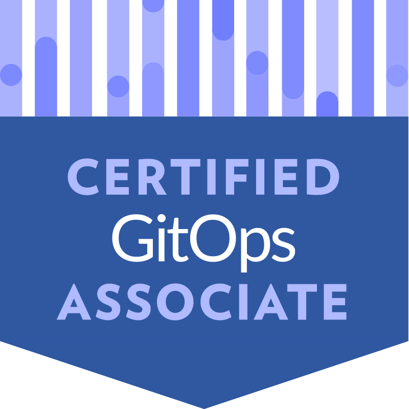
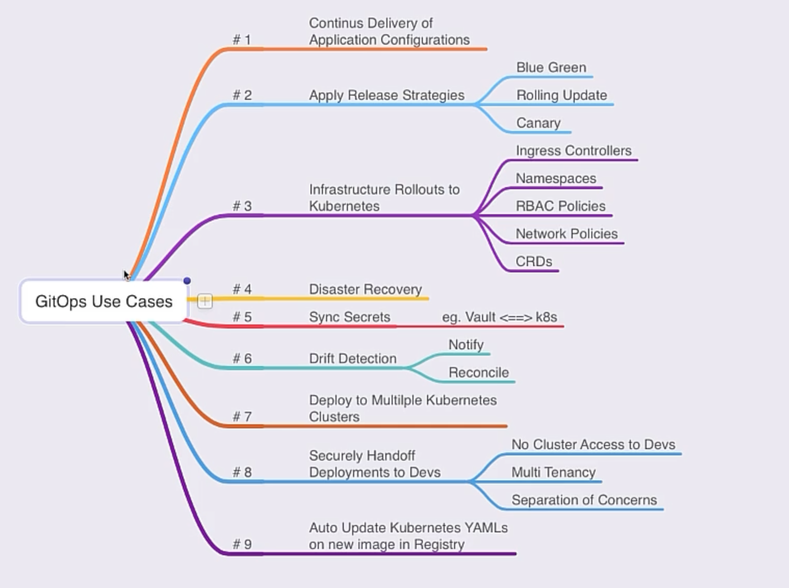
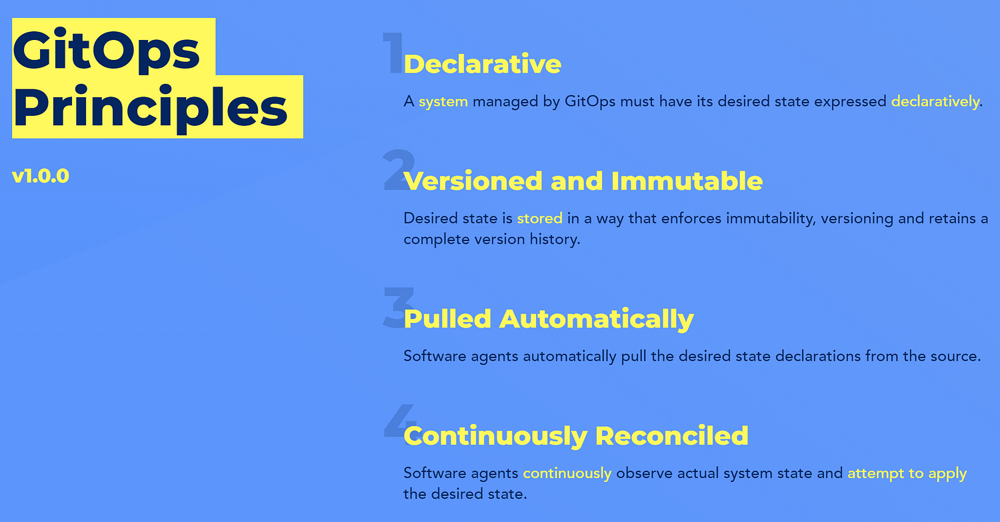

# Certified GitOps Associate (CGOA) Certification Study Guide

> 📌 Last updated: May 17, 2025 – CGOA exam passed on May 17

  

Based on its format and scope, I think CGOA might be one of the easiest certifications to start for those already familiar with DevOps, CI/CD, Git workflows, and tools like Terraform, Ansible, ArgoCD, and Helm. Since it's a multiple-choice exam focused on principles rather than hands-on tasks, it seems more approachable compared to other certifications in the Golden Kubestronaut bundle.

🧠 **Key takeaway:** The exam leans heavily toward concepts, workflows, and best practices rather than tool-specific knowledge.

## 📚 Table of Contents

- [🧑‍💻 Who This Is For](#who-this-is-for)
- [📅 Details About the Exam](#details-about-the-exam)
  - [💰 Pricing & Registration](#pricing--registration)
  - [🧪 Exam Tutorial (Optional, Worth Considering)](#exam-tutorial-optional-worth-considering)
- [📖 Study Guide](#study-guide)
  - [GitOps Terminology (20%)](#gitops-terminology-20)
  - [GitOps Principles (30%)](#gitops-principles-30)
  - [Related Practices (16%)](#related-practices-16)
  - [GitOps Patterns (20%)](#gitops-patterns-20)
  - [Tooling (%14)](#tooling-14)
- [📘 GitOps Practice Questions](#gitops-practice-questions)
  - [GitOps Terminology (20%)](#gitops-terminology-20)
  - [GitOps Principles (30%)](#gitops-principles-30)
  - [Related Practices (16%)](#related-practices-16)
  - [GitOps Patterns (20%)](#gitops-patterns-20)
  - [Tooling (14%)](#tooling-14)
- [🔗 Official & Community Resources](#official--community-resources)

## Who This Is For

- You’re a beginner trying to grasp DevOps, IaC, and CI/CD fundamentals — with an eye toward eventually adopting GitOps practices.
- You're familiar with DevOps, IaC, or CI/CD and want to transition into GitOps.
- You're looking for a lightweight CNCF certification to start with.
- You're exploring bundle deals like Golden Kubestronaut or THRIVE and want to make the most of them.

## Details About the Exam

While tools like ArgoCD, Flux, and Helm may appear, the focus is on understanding their role in **GitOps workflows** rather than command-line syntax or installation steps.

- **Type:** Online, proctored, multiple-choice test
- **Duration:** 90 minutes
- **Validity:** 2 years
- **Retake Policy:** One free retake included
- **Eligibility Period:** 12 months from purchase to schedule and take the exam
- **Environment:** Browser-based exam platform (secure, ID required)

The exam is broken down into the following domains:

| Domain               | Weight |
|----------------------|--------|
| GitOps Terminology   | 20%    |
| GitOps Principles    | 30%    |
| Related Practices    | 16%    |
| GitOps Patterns      | 20%    |
| Tooling              | 14%    |

> Curriculum PDF: [CGOA Curriculum (CNCF)](https://github.com/cncf/curriculum/blob/master/CGOA_Curriculum.pdf)

To pass, you will need a score above 75%.

### Pricing & Registration

- **Exam Only (Standard Price):** $250 USD  
- **Bundle Options:** May vary. CGOA is often included in larger training bundles.

In my case, I accessed the certification through the **Golden Kubestronaut** bundle, which includes multiple CNCF/Linux Foundation resources and certifications.

#### My Recommendation

Unless you're in a rush or have a very specific reason:

> 💡 **Don’t buy the CGOA exam standalone at full price.**

Instead:

- ✅ **Look for bundles** that include CGOA (e.g., Golden Kubestronaut, THRIVE, or seasonal promos)
- ✅ **Wait for discounts or coupon codes** (Cyber Monday, KubeCon, etc.)

This certification is one of the **easiest to start** for people familiar with DevOps, CI/CD, and Git workflows, so it's a great entry point—but **only makes financial sense as part of a larger deal**.

### 🧪 Exam Tutorial (Optional, Worth Considering)

There's a **Tutorial Test** available before your actual CGOA exam, which might help you get familiar with:

- The secure browser
- The remote proctoring test environment

You can take it **up to 3 times**, and it lasts about **30 minutes**.  The link expires **150 minutes before** your scheduled exam.

> I haven’t tried the tutorial myself yet, but it seems like a good idea to explore—especially to avoid surprises with the test interface.

If you have time the day before or a few days in advance, it might be worth checking out.

## Study Guide

Based on the official curriculum, the CGOA exam is divided into  chapters covering **terminology**, **principles**, **practices**, **patterns**, and **tooling**.

> ⚠️ **If you're completely new to Cloud Computing, DevOps, containerization, or Kubernetes**, it's best to start with:
>
> - [**Introduction to DevOps and Site Reliability Engineering (LFS162)**](https://training.linuxfoundation.org/training/introduction-to-devops-and-site-reliability-engineering-lfs162/) – A solid foundation in DevOps concepts, culture, and SRE principles
>
> Then continue with:
>
> - [**Introduction to GitOps (LFS169)**](https://trainingportal.linuxfoundation.org/courses/introduction-to-gitops-lfs169) – A beginner-friendly entry point into GitOps workflows and use

Now, let's take a closer look at each of these areas.

### GitOps Terminology (20%)

**Why GitOps?**  

There are several use cases where GitOps shines — the most obvious include automation, continuous delivery, security, and compliance.

  

📚 *Source:* [LFS169 - Introduction to GitOps](https://trainingportal.linuxfoundation.org/learn/course/introduction-to-gitops-lfs169/gitops-concepts/gitops-concepts-overview?page=3)  
See: *“GitOps Use Cases - What Can You Do with GitOps?”*

#### Continuous

"Continuous" is intended to match the industry standard term: reconciliation continues to happen, not that it must be instantaneous.

#### Declarative Description

#### Desired State

#### State Drift

#### State Reconciliation

#### GitOps Managed Software System

#### State Store

#### Feedback Loop

#### Rollback

### GitOps Principles (30%)

GitOps is a set of principles for operating and managing software systems. These principles are derived from modern software operations, but are also rooted in pre-existing and widely adopted best practices.

  

📚 *Source:* [How to Ace the (CGOA) Certified GitOps Associate Exam](https://cd.foundation/blog/2024/07/10/ace-cgoa-exam/)  

The desired state of a GitOps managed system must be:

#### Declarative:
A system managed by GitOps must have its desired state expressed declaratively.

#### Versioned and Immutable:
Desired state is stored in a way that enforces immutability, versioning and retains a complete version history.

#### Pulled Automatically:
Software agents automatically pull the desired state declarations from the source.

#### Continuously Reconciled:
Software agents continuously observe actual system state and attempt to apply the desired state.

📚 *Source:* [GitOps Principles v1.0.0](https://github.com/open-gitops/documents/blob/v1.0.0/PRINCIPLES.md)

### Related Practices (16%)

#### Configuration as Code (CaC)

#### Infrastructure as Code (IaC)

#### DevOps and DevSecOps

**DevOps (Development + Operations)** is a set of practices, principles, and cultural philosophies that aim to enhance collaboration and communication between software development (Dev) and IT operations (Ops) teams. The primary goal is to automate and streamline the processes of software delivery and infrastructure changes, fostering a culture of continuous improvement and faster, more reliable releases.

📚 *Source:* [LFS162 - Introduction to DevOps and Site Reliability Engineering](https://trainingportal.linuxfoundation.org/learn/course/introduction-to-devops-and-site-reliability-engineering-lfs162/introduction-to-devops-and-sre/what-is-devops-and-site-reliability-engineering-sre?page=1)  
See: *“What is DevOps and Site Reliability Engineering (SRE)?”*

**DevSecOps (Development + Security + Operations)**

#### CI and CD

### GitOps Patterns (20%)

#### Deployment and Release Patterns
#### Progressive Delivery Patterns
#### Pull vs. Event-driven
#### Architecture Patterns (in-cluster and external reconciler, state store management, etc.)

### Tooling (%14)

#### Manifest Format and Packaging
#### State Store Systems (Git and alternatives)
#### Reconciliation Engines (ArgoCD, Flux, and alternatives)
#### Interoperability with Notifications, Observability, and Continuous Integration Tools

# GitOps Practice Questions

> ⚠️ Disclaimer: The following questions are sourced from **online materials** (🌐) and **AI-generated examples** (🤖).  
> They are intended for self-study only. No responsibility is taken for accuracy or interpretation.

---

🧾 <strong>GitOps Terminology (20%)</strong>

### 🌐 In GitOps, how is a feedback loop established?

**a)** By integrating CI/CD  
**b)** By using automated test suites  
**c)** By manually reviewing configurations  
**d)** By monitoring the infrastructure and making adjustments as needed  

🟩 Show Answer

✅ **d)**  
**Explanation:** GitOps tools monitor system state and reconcile with Git, forming a feedback loop.

---

### 🤖 What does "declarative" mean in the context of GitOps?

**a)** Describing step-by-step commands  
**b)** Describing the final state, tooling determines how to reach it  
**c)** Using shell scripts to configure infra  
**d)** Dynamically adjusting state based on input  

🟩 Show Answer

✅ **b)**  
**Explanation:** Declarative means describing *what* you want, not *how* to achieve it.

---

### 🌐 Which of the following describes a "versioned and immutable" approach in GitOps? *(Choose Two)*

**a)** Each change is tracked in version control  
**b)** Configs can be edited without new versions  
**c)** Older versions cannot be altered once committed  
**d)** Allows manual overrides  

🟩 Show Answer

✅ **a, c**  
**Explanation:** Git commits are immutable; all changes are versioned and auditable.

---

### 🤖 Why is immutability important in GitOps?

**a)** Allows devs to freely overwrite configs  
**b)** Prevents any audit trail  
**c)** Enables reproducibility, rollback, and traceability  
**d)** Improves runtime performance  

🟩 Show Answer

✅ **c)**  
**Explanation:** Immutability makes GitOps safe and reversible.

---

### 🌐 What does it mean for GitOps configurations to be "versioned and immutable"?

**a)** Each change creates a new, unalterable version  
**b)** Older versions can be overwritten  
**c)** Reverting is not possible  
**d)** Multiple changes in same version  

🟩 Show Answer

✅ **a)**  
**Explanation:** Every Git commit creates a new immutable snapshot of the system state.

---

🧱 <strong>GitOps Principles (30%)</strong>

### 🌐 Which principle is central to GitOps workflows?

**a)** Manual code deployment  
**b)** Decentralized infra management  
**c)** Automation of deployments via Git commits  
**d)** Manual backups  

🟩 Show Answer

✅ **c)**  
**Explanation:** Git commits trigger reconciliation automatically.

---

### 🌐 Which of the following best defines GitOps?

**a)** Manual deployment process  
**b)** Git as source of truth + declarative infra + automation  
**c)** A VCS for software projects  
**d)** A CI tool  

🟩 Show Answer

✅ **b)**  
**Explanation:** GitOps is a practice that uses Git and declarative config for automation.

---

### 🌐 How does GitOps relate to DevOps?

**a)** Replaces DevOps  
**b)** Subset of DevOps focusing on Git + automation  
**c)** Ignores DevOps  
**d)** Only applies to containers  

🟩 Show Answer

✅ **b)**  
**Explanation:** GitOps builds on DevOps practices by automating delivery using Git.

---

### 🤖 What is the purpose of a reconciliation loop?

**a)** Trigger manual deployments  
**b)** Audit network traffic  
**c)** Ensure system matches desired state  
**d)** Validate CI pipeline  

🟩 Show Answer

✅ **c)**  
**Explanation:** Reconciliation continuously syncs cluster state with Git.

---

### 🤖 Which Git feature makes it well-suited for GitOps?

**a)** Merge conflicts  
**b)** Branching/forking  
**c)** Immutable commit history  
**d)** File size limits  

🟩 Show Answer

✅ **c)**  
**Explanation:** Git tracks changes immutably, which aligns perfectly with audit/compliance goals.

---

### 🤖 Which of the following is not a GitOps principle?

**a)** Declarative infra  
**b)** Pull-based automation  
**c)** Centralized ticketing systems  
**d)** Continuous reconciliation  

🟩 Show Answer

✅ **c)**  
**Explanation:** GitOps focuses on Git-based automation — not manual ticket-driven workflows.

---

🔁 <strong>Related Practices (16%)</strong>

### 🌐 What does CI aim to achieve?

**a)** Faster code defect identification  
**b)** DevOps team collaboration  
**c)** Auto deployment to prod  
**d)** Infra monitoring  

🟩 Show Answer

✅ **a)**  
**Explanation:** CI automates testing to catch bugs earlier.

---

### 🌐 Benefits of CI/CD? *(Choose Three)*

**a)** Faster deployments  
**b)** Reduced risk of failure  
**c)** Lower security risks  
**d)** Easier rollback  

🟩 Show Answer

✅ **a, b, d**  
**Explanation:** CI/CD accelerates delivery and improves rollback capabilities.

---

### 🤖 What distinguishes GitOps from traditional CD?

**a)** Pull-based from Git  
**b)** Jenkins dependency  
**c)** Git not used  
**d)** Manual sync  

🟩 Show Answer

✅ **a)**  
**Explanation:** GitOps flips CD by making deployments pull-based, not push-based.

---

### 🌐 How does IaC differ from traditional infra mgmt?

**a)** Code defines + manages infra  
**b)** Manual config required  
**c)** Eliminates sysadmins  
**d)** Imperative command reliance  

🟩 Show Answer

✅ **a)**  
**Explanation:** IaC treats infra as code — versioned, repeatable, automatable.

---

### 🤖 How does GitOps improve compliance?

**a)** Unrestricted access  
**b)** Avoiding Git  
**c)** Git logs + RBAC workflows  
**d)** No auth required  

🟩 Show Answer

✅ **c)**  
**Explanation:** GitOps provides a clear audit trail and integrates with access control.

---

🎯 <strong>GitOps Patterns (20%)</strong>

### 🌐 What triggers a rollback in GitOps? *(Choose Two)*

**a)** State drift  
**b)** Failed deployment  
**c)** Manual revert  
**d)** Scheduled maintenance  

🟩 Show Answer

✅ **b, c**  
**Explanation:** GitOps rollbacks are either triggered by failure or manual Git action.

---

### 🌐 Which describes a GitOps workflow?

**a)** Manual prod updates  
**b)** Auto deploy from Git  
**c)** Manual infra testing  
**d)** GitHub backups  

🟩 Show Answer

✅ **b)**  
**Explanation:** GitOps deploys automatically from Git via reconciliation loops.

---

### 🌐 Desired state characteristics? *(Choose Two)*

**a)** Defined in code  
**b)** Maintained automatically  
**c)** Requires manual changes  
**d)** Requires manual config  

🟩 Show Answer

✅ **a, b**  
**Explanation:** Desired state is codified and enforced via automation.

---

### 🤖 How do GitOps tools detect drift?

**a)** Listen to Kubernetes events  
**b)** Scan container registries  
**c)** Poll CI  
**d)** Compare GitHub Actions  

🟩 Show Answer

✅ **a)**  
**Explanation:** GitOps agents watch K8s API and sync based on Git state.

---

### 🤖 What is a GitOps anti-pattern?

**a)** Git as truth  
**b)** Encrypted secrets in Git  
**c)** Manual cluster edits outside Git  
**d)** Helm chart usage  

🟩 Show Answer

✅ **c)**  
**Explanation:** Any change outside Git breaks the GitOps trust model.

---

🔧 <strong>Tooling (14%)</strong>

### 🌐 Which tool is used for GitOps deployments?

**a)** Docker  
**b)** ArgoCD  
**c)** Jenkins  
**d)** GitHub  

🟩 Show Answer

✅ **b)**  
**Explanation:** ArgoCD is a Kubernetes-native GitOps controller.

---

### 🌐 What is Git's role in GitOps?

**a)** Database  
**b)** Source of truth  
**c)** Code compiler  
**d)** Network manager  

🟩 Show Answer

✅ **b)**  
**Explanation:** Git stores the desired configuration state.

---

### 🤖 Role of CRDs in GitOps?

**a)** Replace YAML  
**b)** Declaratively extend Kubernetes for GitOps  
**c)** Disable drift detection  
**d)** Flux-only feature  

🟩 Show Answer

✅ **b)**  
**Explanation:** CRDs define custom resources GitOps tools can manage declaratively.

## Official & Community Resources

- **Official Curriculum:**  
  [CGOA Curriculum PDF (CNCF)](https://github.com/cncf/curriculum/blob/master/CGOA_Curriculum.pdf)

- **Unofficial Study Guide:**  
  [GitHub – otkd/CGOA-Study-Guide](https://github.com/otkd/CGOA-Study-Guide)

- **Open GitOps:**
  [GitOps Glossary v1.0.0](https://github.com/open-gitops/documents/blob/v1.0.0/GLOSSARY.md)

- **Free Courses:**  
  * [Linux Foundation – Introduction to GitOps (LFS169)](https://trainingportal.linuxfoundation.org/courses/introduction-to-gitops-lfs169)
  * [Linux Foundation – Introduction to DevOps and Site Reliability Engineering (LFS162)](https://training.linuxfoundation.org/training/introduction-to-devops-and-site-reliability-engineering-lfs162/)
- **Exam Tips & Insights:**  
  * [CD Foundation Blog – Ace the CGOA Exam](https://cd.foundation/blog/2024/07/10/ace-cgoa-exam/?utm_content=300040572&utm_medium=social&utm_source=linkedin&hss_channel=lcp-19100461)
  * [Exam Sample Questions](https://www.vmexam.com/linux-foundation/linux-foundation-cgoa-certification-exam-sample-questions)